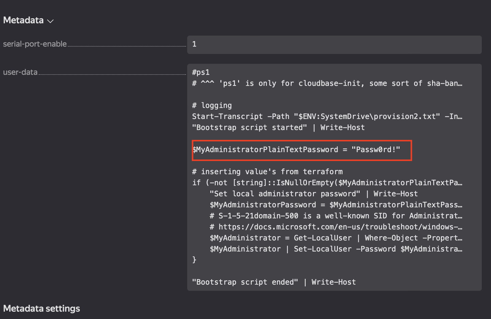
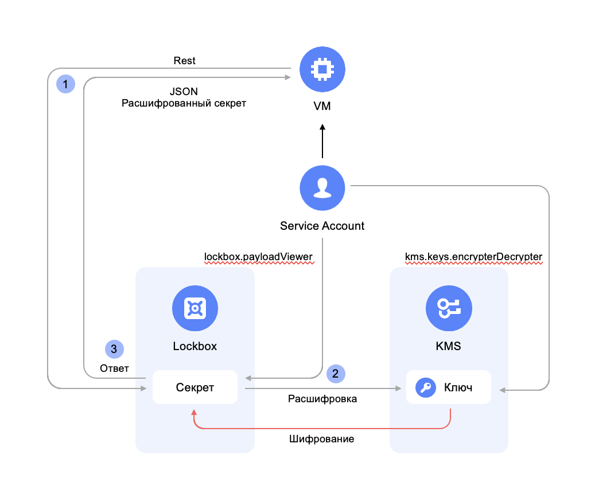
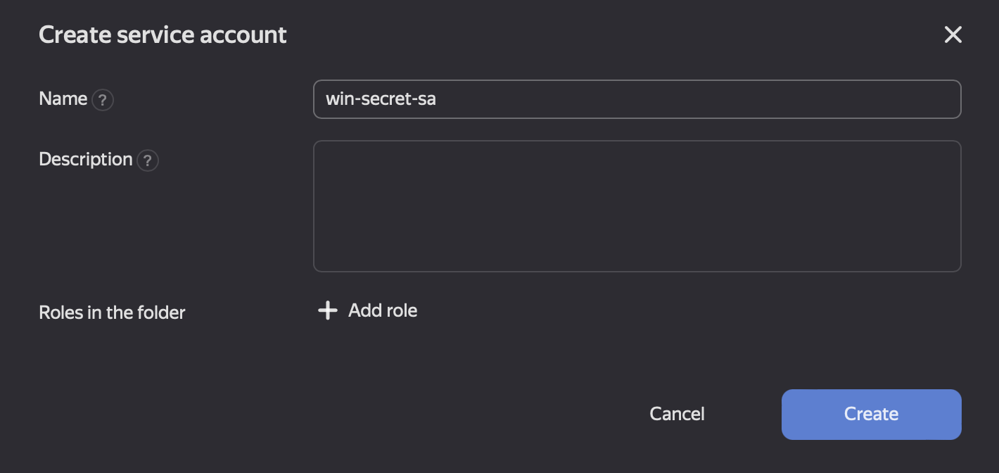
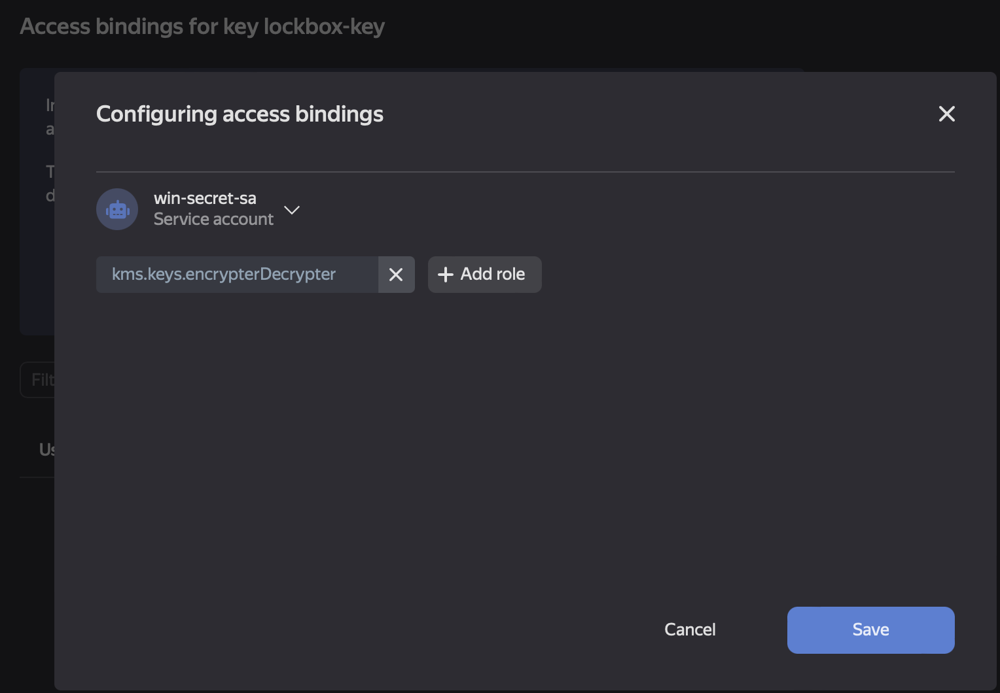
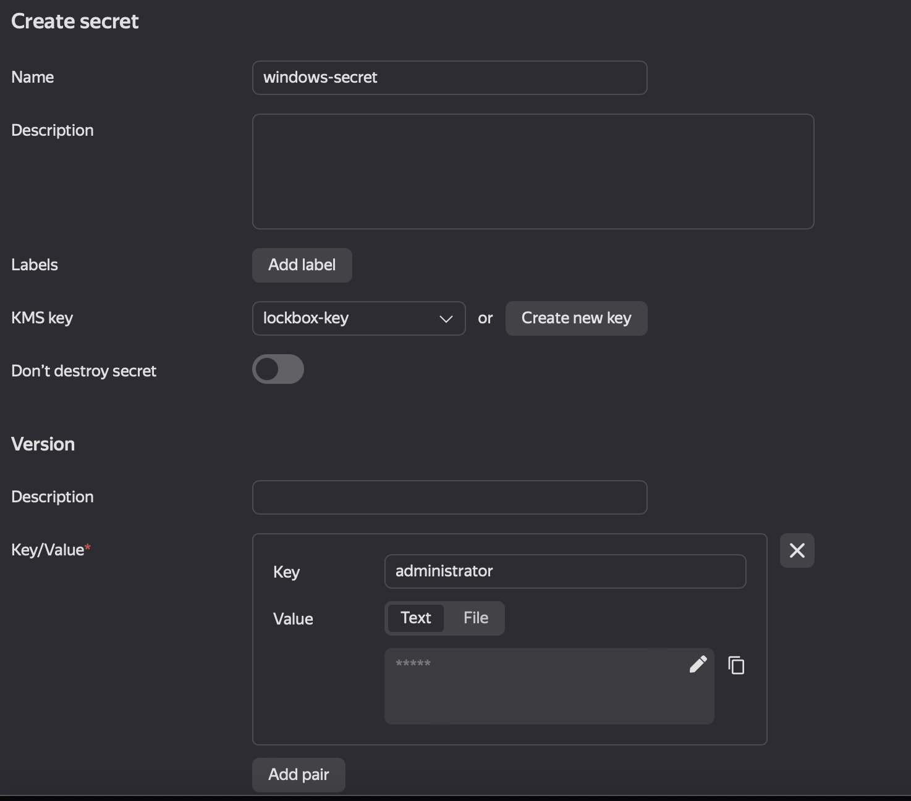
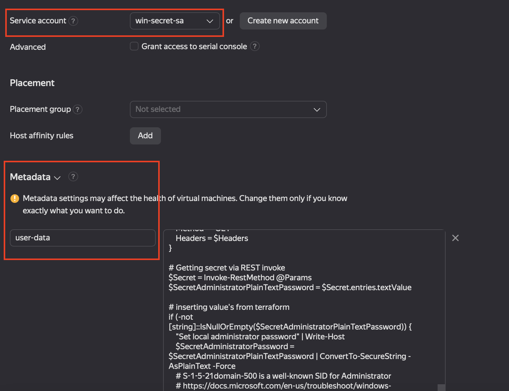
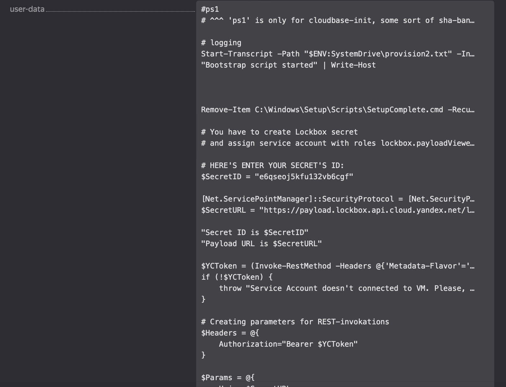

# YC Windows VM Безопасная передача паролей в скрипт инициализации
## Проблема
С тех пор как в UI появилось возможность просматривать метаданные ВМ - любой администратор облака или каталога может узнать пароль от гостевой операционной системы. При этом, администраторы облачных контейнеров не обязательно должны иметь доступ к гостевой ОС. Пример:


В связи с этим, [скрипт инициализации](https://cloud.yandex.ru/docs/tutorials/infrastructure-management/terraform-quickstart#users) предлагается расширить с использованием сервиса Lockbox параллельно автоматизировав создание пользователей.

## Решение
Назначенный на виртуальную машину сервисный аккаунт может аутентифицироваться и авторизоваться в IAM изнутри гостевой ОС по упрощенной схеме. Т.е. достаточно просто получить IAM-токен через yc cli или REST API, не передавая никакой информации о субъекте. Это дает возможность при минимально необходимых правах безопасно передать в гостевую ОС пару ключ/значение (секретная часть) из Lockbox с помощью сервисного аккаунта. 


### 1. Создать сервисный аккаунт
На уровне каталога на вкладке `Service Accounts` создадим сервисный аккаунт в контексте которого скрипт будет обращаться к сервисам KMS и Lockbox.

Обратите внимание, что на данном этапе роли не назначаются, тк роли уровня каталога дадут сервисному аккаунту доступ ко всем ключам и секретам каталога.

### 2. Создать ключ KMS
Создадим ключ KMS и на вкладке **Access Bindings** ключа назначим сервисному аккаунту роль `kms.keys.encrypterDercrypter`.

Роль на уровне ключа гарантирует гранулярный доступ к операциям на конкретном ключе для сервисного аккаунта.

### 3. Создать секрет в Lockbox
Создадим секрет с указанием ключа шифрования.

В одном секрете может быть несколько пар ключ-значение. Каждая пара ключ-значение представляет из себя логин и пароль пользователя. Первым всегда должен стоять локальный администратор по умолчанию. Остальные пользователи будут циклично созданы с минимальными правами в ОС.
На вкладке **Access Bindings** выдадим сервисному аккаунту роль `lockbox.payloadViewer`


### 4. Создать Виртуальную машину
Создадим файл `init.ps1` с содержимым:

```PowerShell
#ps1
# ^^^ 'ps1' is only for cloudbase-init, some sort of sha-bang in linux

# logging
Start-Transcript -Path "$ENV:SystemDrive\provision2.txt" -IncludeInvocationHeader -Force
"Bootstrap script started" | Write-Host

# You have to create Lockbox secret 
# and assign service account with roles lockbox.payloadViewer and kms.key.encryptorDecryptor to VM

# HERE'S ENTER YOUR SECRET'S ID OF IMPORT FROM TERRAFORM VARIABLE:
$SecretID = "<YOUR_LOCBOX_SECRET_ID>"

[Net.ServicePointManager]::SecurityProtocol = [Net.SecurityProtocolType]::Tls12
$SecretURL = "https://payload.lockbox.api.cloud.yandex.net/lockbox/v1/secrets/$SecretID/payload"

"Secret ID is $SecretID"
"Payload URL is $SecretURL"

$YCToken = (Invoke-RestMethod -Headers @{'Metadata-Flavor'='Google'} -Uri "http://169.254.169.254/computeMetadata/v1/instance/service-accounts/default/token").access_token
if (!$YCToken) {
    throw "Service Account doesn't connected to VM. Please, add Service account with roles lockbox.payloadViewer and kms.key.encryptorDecryptor to VM and try again."
}

# Creating parameters for REST-invokations
$Headers = @{
    Authorization="Bearer $YCToken"
}

$Params = @{
    Uri = $SecretURL
    Method = "GET"
    Headers = $Headers
}

# Getting secret via REST invoke
$Secret = Invoke-RestMethod @Params
$SecretAdministratorPlainTextPassword = $Secret.entries[0].textValue

# inserting value's from terraform
if (-not [string]::IsNullOrEmpty($SecretAdministratorPlainTextPassword)) {
    "Set local administrator password" | Write-Host
    $SecretAdministratorPassword = $SecretAdministratorPlainTextPassword | ConvertTo-SecureString -AsPlainText -Force
    # S-1-5-21domain-500 is a well-known SID for Administrator
    # https://docs.microsoft.com/en-us/troubleshoot/windows-server/identity/security-identifiers-in-windows
    $Administrator = Get-LocalUser | Where-Object -Property "SID" -like "S-1-5-21-*-500"
    $Administrator | Set-LocalUser -Password $SecretAdministratorPassword
}

# Creating new users if any
if($Secret.entries.count -gt 1) {
    foreach($User in $Secret.entries[1..($Secret.entries.count-1)]){
        $SecretUserPassword = $User.textValue | ConvertTo-SecureString -AsPlainText -Force
        New-LocalUser -Name $User.key -Password $SecretUserPassword -FullName $User.key
        Add-LocalGroupMember -Group Users -Member $User.key
        Add-LocalGroupMember -Group "Remote Desktop Users" -Member $User.key
    }
}

"Bootstrap script ended" | Write-Host
```

Здесь в переменную `$SecretID` необходимо указать id секрета Lockbox. Тк id секрета - не сам секрет, то это не является чувствительной информацией.

**Создание ВМ (yc cli):**
```Bash
yc compute instance create --name <vm_name> --hostname <guest os name> --zone ru-central1-a --create-boot-disk image-id=<imade_id> --cores 2 --core-fraction 100 --memory 4 --metadata-from-file user-data=init.ps1  --network-interface subnet-name=<subnet name>,nat-ip-version=ipv4 --service-account-name <service_account_name> --platform standard-v3
```

**Создание ВМ (UI):**
В UI можно передать в user-data скрипт инициализации. Для этого в поле `key` нужно написать `user-data`, а в поле `Value` вставить скрипт инициализации


### 5. Проверка
Теперь в метаданных ВМ чувствительные данные отсутствуют:


